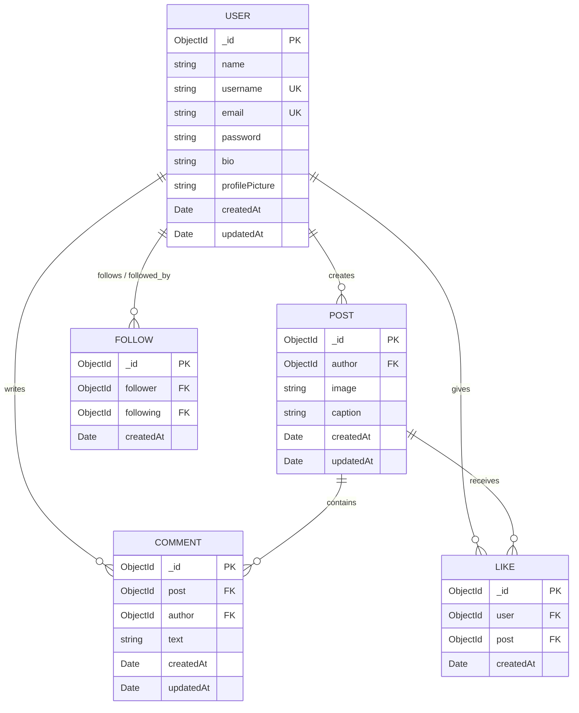

# 📸 Instagram Lite

A streamlined, robust backend and database architecture for a social media platform inspired by Instagram, built with **Node.js**, **MongoDB**, and **Mongoose ODM**.

---

## 📌 Overview

**Instagram Lite** implements the core database design, relationships, indexing strategies, and CRUD business logic needed for a scalable social media backend. It demonstrates real-world data modeling patterns including user authentication schemas, post feeds, social graph connections (followers/following), likes with uniqueness constraints, and comment threads.

---

## ✨ Features

- 👤 **User Management**: User registration, profile customization (bio, avatar), and validation.
- 🖼️ **Post Management**: Post creation with image URLs and captions, populated with author details.
- ❤️ **Like System**: Like/unlike functionality with compound unique indexes to eliminate duplicate likes.
- 💬 **Comment System**: Comment threads attached to posts with author referencing and chronological sorting.
- 👥 **Social Graph (Follow System)**: Follow/unfollow mechanism with self-follow prevention and fast bidirectional lookups.
- 📰 **Dynamic Feed Generation**: Personalized feed showing latest posts from followed users.
- 📊 **Profile Aggregation**: Comprehensive profile view compiling user details, posts, post count, follower count, and following count.
- ⚡ **Optimized Indexing**: Strategic compound and unique indexes for fast lookups and high query performance.

---

## 🛠️ Tech Stack

- **Runtime**: [Node.js](https://nodejs.org/)
- **Database**: [MongoDB](https://www.mongodb.com/)
- **ODM**: [Mongoose](https://mongoosejs.com/) (v9+)
- **Language**: JavaScript (ES6+ / Async-Await)

---

## 🗄️ Database Architecture & Schemas

### Entity Relationship Diagram (ERD)



---

## ⚡ Indexing & Optimization Strategy

To ensure peak performance as data scales, the following index design is applied:

| Collection | Indexed Fields | Type / Constraint | Purpose |
| :--- | :--- | :--- | :--- |
| **`users`** | `username` | Unique | Prevent duplicate handles & enable fast login queries |
| **`users`** | `email` | Unique | Enforce single account per email address |
| **`posts`** | `{ author: 1, createdAt: -1 }` | Compound Index | Optimizes profile posts and feed queries in reverse chronological order |
| **`comments`** | `{ post: 1, createdAt: -1 }` | Compound Index | Fast retrieval of latest comments for any specific post |
| **`likes`** | `{ user: 1, post: 1 }` | Compound Unique | Prevents a user from liking the same post more than once |
| **`follows`** | `{ follower: 1, following: 1 }` | Compound Unique | Prevents duplicate follow records |
| **`follows`** | `following` | Secondary Index | Fast lookups for *“Who is following user X?”* |

---

## 📁 Project Structure

```bash
instagram-lite/
├── Instagram lite/
│   ├── models/
│   │   ├── Comment.js          # Comment Schema & Model
│   │   ├── Follow.js           # Follow Schema & Graph Model
│   │   ├── Like.js             # Like Schema & Unique Index Model
│   │   ├── Post.js             # Post Schema & Model
│   │   └── User.js             # User Schema & Validation Rules
│   ├── readme/
│   │   ├── core_requirements.txt  # Functional & technical requirements
│   │   ├── index-overview.txt     # Summary of MongoDB indexes
│   │   ├── objective.txt          # Project learning objectives
│   │   └── plan.txt               # Step-by-step development roadmap
│   ├── 1-users-crud.js         # User CRUD demonstration script
│   ├── 2-posts-crud.js         # Post CRUD demonstration script
│   ├── 3-comments-crud.js      # Comments CRUD demonstration script
│   ├── 4-likes-crud.js         # Likes CRUD demonstration script
│   ├── 5-follows-crud.js       # Follows CRUD demonstration script
│   ├── 6-feed-query.js         # Feed generation aggregation script
│   ├── 7-profile-query.js      # Profile overview aggregation script
│   ├── db.js                   # MongoDB connection configuration
│   ├── package.json            # Node.js dependencies
│   └── package-lock.json
└── README.md                   # Project documentation
```

---

## 🚀 Getting Started

### Prerequisites

- [Node.js](https://nodejs.org/) (v16 or higher)
- [MongoDB](https://www.mongodb.com/try/download/community) installed and running locally on port `27017` (or MongoDB Atlas connection URI).

### 1. Clone the Repository

```bash
git clone https://github.com/namaysingh3925/instagram-lite.git
cd instagram-lite
```

### 2. Install Dependencies

Navigate into the project directory and install dependencies:

```bash
cd "Instagram lite"
npm install
```

### 3. Start Local MongoDB

Ensure your MongoDB service is running:

```bash
# Windows (Services / CMD)
net start MongoDB

# Or with mongod CLI:
mongod --dbpath <path-to-data-directory>
```

### 4. Run Scripts & Test Operations

You can run each module independently to test database operations:

```bash
# 1. Test User CRUD operations
node 1-users-crud.js

# 2. Test Post creation and population
node 2-posts-crud.js

# 3. Test Commenting system
node 3-comments-crud.js

# 4. Test Liking and unliking logic
node 4-likes-crud.js

# 5. Test Follow/Unfollow graph operations
node 5-follows-crud.js

# 6. Test Feed query for followed users
node 6-feed-query.js

# 7. Test User profile summary query
node 7-profile-query.js
```

---

## 🗺️ Roadmap & Planned Extensions

- [x] Core MongoDB schemas & validation
- [x] CRUD operations for Users, Posts, Likes, Comments, and Follows
- [x] Feed & Profile aggregation queries
- [ ] Express.js REST API layer (`/api/auth`, `/api/posts`, `/api/users`, etc.)
- [ ] JWT Authentication & Authorization Middleware
- [ ] Password hashing with `bcrypt`
- [ ] React Frontend with modern UI
- [ ] Cloudinary / AWS S3 image upload support
- [ ] Real-time notifications and Direct Messaging (Socket.io)
- [ ] Stories & Explore feature

---

## 📄 License

This project is open-source and available under the [MIT License](LICENSE).

---

## 👨‍💻 Author

**Namay Singh**  
GitHub: [@namaysingh3925](https://github.com/namaysingh3925)
